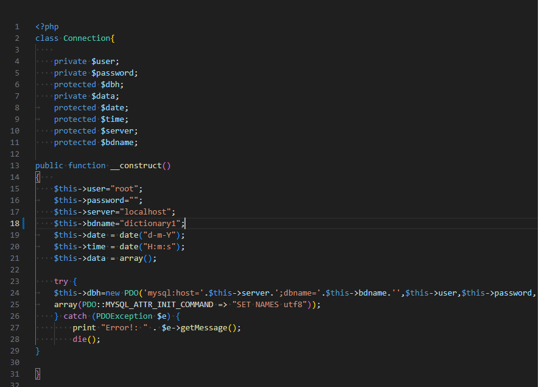

# CarDictionary

**CarDictionary** es un diccionario de palabras personalizado, diseñado para facilitar la creación y gestión de términos específicos en diversos campos. Este proyecto fue desarrollado a solicitud de un cliente y es ideal para organizar vocabularios en diferentes ámbitos, como el taller, la medicina, la programación, entre otros.

**Año de Desarrollo:** 2020

## Ejemplos de Uso

1. Diccionario de Taller
2. Diccionario Veterinario
3. Diccionario de Programación
4. Diccionario de Medicina

## Configuración Requerida

Para asegurar el funcionamiento correcto del proyecto, debes habilitar la extensión `zip` en tu configuración de PHP.

### Activar la Extensión `zip` en `php.ini`

1. **Localiza el archivo `php.ini`:** Este archivo generalmente se encuentra en el directorio de configuración de tu instalación de PHP.

2. **Edita el archivo `php.ini`:** Abre el archivo `php.ini` con un editor de texto.

3. **Busca la línea que contiene:** 
;extension=zip

4. **Descomenta la línea:** 
Elimina el punto y coma (`;`) al inicio de la línea, dejándola como:

5. **Guarda los cambios y reinicia el servidor web** para aplicar la nueva configuración.

Si no encuentras el archivo `php.ini` o enfrentas problemas para modificarlo, consulta la documentación de tu servidor web o entorno de desarrollo para obtener más detalles.

## Dependencias

### VENDOR

Los archivos del directorio `vendor` están incluidos al descargar el proyecto.

### Configuración de la Base de Datos

La configuración de la base de datos se realiza en el archivo `connection.php`, donde debes ingresar tu usuario y contraseña.

Se proporciona una base de datos precargada para el funcionamiento de la aplicación web.

### Seguridad de los Datos

Ten en cuenta que la aplicación tiene una seguridad básica para los datos. Está diseñada para su uso en entornos internos donde no haya exposición a la red. Se recomienda mejorar la seguridad si se va a utilizar en un entorno más accesible.

## Capturas de Pantalla

### Pantalla Principal

### Ejemplo de Configuración

## Créditos

Desarrollado por [Alex Pérez]